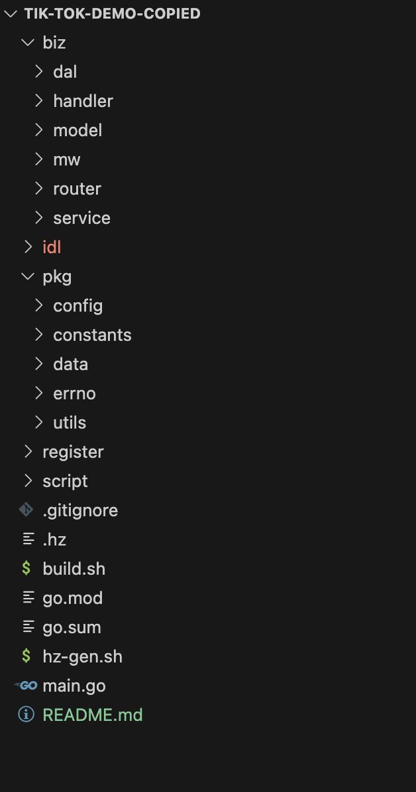

# 开发日志

### Version 1

单机版，复写https://github.com/cloudwego/hertz-examples/tree/main/bizdemo/tiktok_demo`

首先复写IDL，生成hertz_gen；

然后依照原项目复写业务代码；




### version 2

引入kitex，微服务版；

改写IDL：增加rpc的IDL，拆分为api、user、video三个微服务；添加必要的rpc服务之间的通信方法：api调用user、video在handler曾调用rpc服务，user于video之间互相调用在service层实现。

在`/pkd`路径下执行`kitex -module my-tiktok ./../idl/rpc/user.thrift`，生成`kitex_gen/user`文件夹

在`/cmd/user`路径下执行`kitex -service user -module my-tiktok -use my-tiktok/pkg/kitex_gen ./../../idl/rpc/user.thrift`生成user rpc服务的轮廓代码

使用了free-car中的rpc调用方式，直接handler=>rpc{handeler=>service=>dal}，所以参考my-note时要把其在client里对rpc调用结果的处理放到http的hanlder中


为减少不必要的diff debug，增加`/pkg/reverse`文件夹，里面放置有base的数据结构到原hertz common包的数据结构的转换。


📝

```go
// rpc返回值处理方式1
if resp.BaseResp.StatusCode != 0 { // todo
  err = errno.NewErrNo(resp.BaseResp.StatusCode, resp.BaseResp.StatusMsg)
}
if err != nil {
  resp := utils.BuildBaseResp(err)
  c.JSON(consts.StatusOK, user.DouyinUserRegisterResponse{
    StatusCode: resp.StatusCode,
    StatusMsg:  resp.StatusMsg,
  })
}
// 处理方式2
res, err := rpc.UserClient.GetUserInfo(context.Background(), &userservice.GetUserInfoRequest{UserId: req.UserId, CurrentUserId: current_user_id})
// 由于直接http也是直接返回rpc的resp，所以不必做转换；前提是http全部转了Nil的base
resp, err := rpc.RPCResponse(res.BaseResp, err)
if err != nil {
  c.JSON(consts.StatusOK, user.DouyinUserRegisterResponse{
    StatusCode: resp.StatusCode,
    StatusMsg:  resp.StatusMsg,
  })
}

func RPCResponse(resp *base.BaseResponse, err error) (*base.BaseResponse, error) { // 定义了但是意义不大
	if resp.StatusCode != 0 { // todo
		err = errno.NewErrNo(resp.StatusCode, resp.StatusMsg)
	}
	if err != nil {
		resp = utils.BuildBaseResp(err)
	}
	return resp, err
}
```

